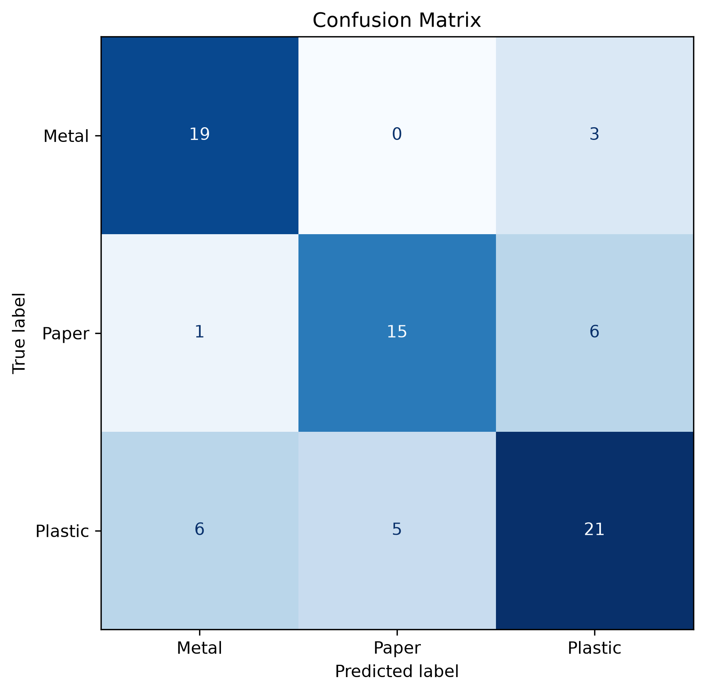
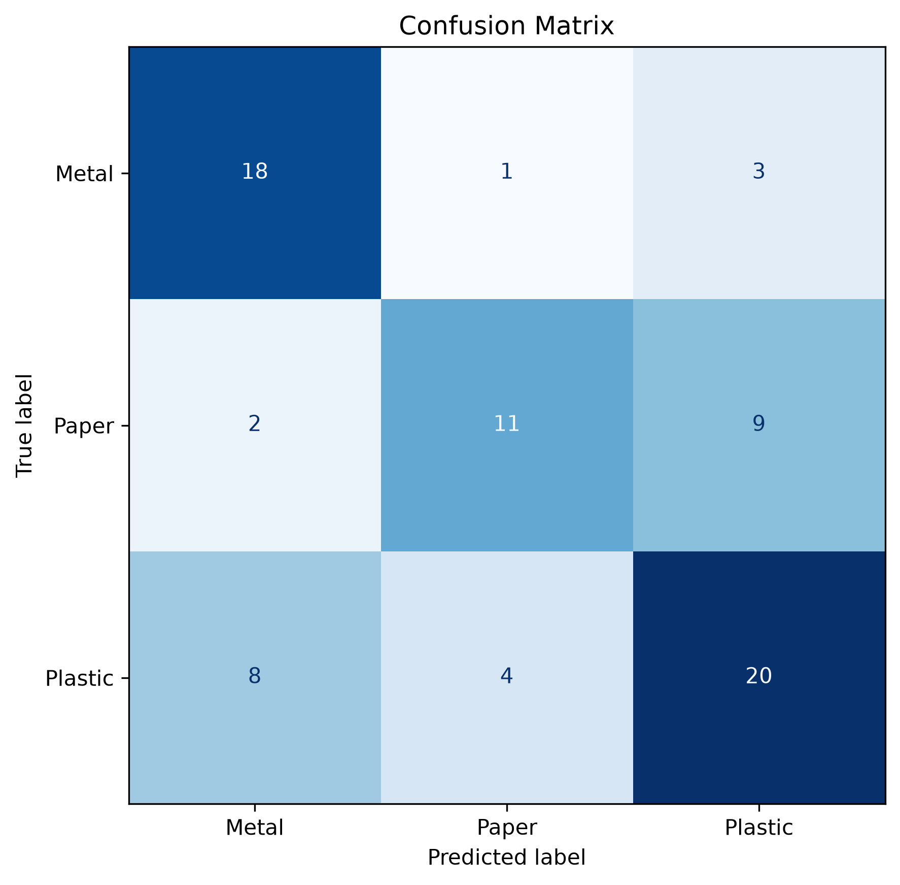
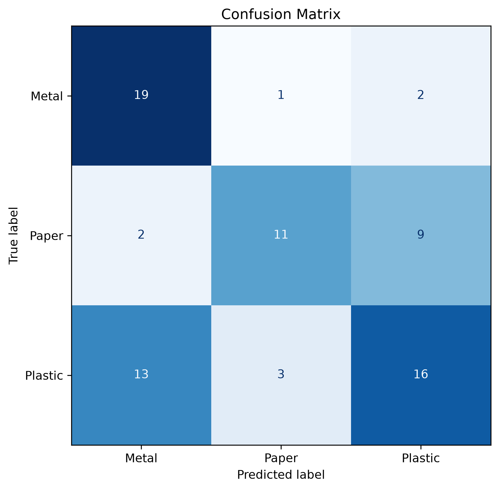

# ♻️ Smart Trash Bin AI

An AI-powered Smart Trash Bin that automatically classifies waste into different categories using Computer Vision and Deep Learning.

> Current Status: Prototype v1.0

---

# Project Overview

This project aims to develop an intelligent waste sorting system capable of recognizing different types of recyclable waste.

Current supported classes:

- Plastic
- Paper
- Metal

The long-term goal is to deploy the trained model on Raspberry Pi for real-time Edge AI inference.

---

# Features

- Image preprocessing pipeline
- Automatic train / validation / test split
- MobileNetV2 Transfer Learning
- Fine-tuning
- Data Augmentation experiment
- Evaluation using:
  - Accuracy
  - Precision
  - Recall
  - F1-score
  - Confusion Matrix
- Training history visualization

---

# Project Structure

```
Smart-Trash-Bin-AI/
│
├── dataset/
│   ├── raw/
│   └── processed/
│       ├── train/
│       ├── val/
│       └── test/
│
├── models/
│
├── outputs/
│
├── src/
│   ├── config.py
│   ├── preprocess.py
│   ├── train.py
│   ├── evaluate.py
│   └── ...
│
├── requirements.txt
├── README.md
└── .gitignore
```

---

# Dataset

Current dataset:

| Class | Images |
|--------|-------:|
| Plastic | ~300 |
| Metal | ~200 |
| Paper | ~200 |

Total:

Approximately **700 images**.

The dataset was manually collected using a smartphone under different lighting conditions and viewing angles.

---

# Model

Current model:

- MobileNetV2
- Image Size: 224 × 224
- Transfer Learning
- Fine-tuning
- TensorFlow / Keras

---

# Experiments

Two training strategies were compared.

### 1. Without Data Augmentation

- Original images only

### 2. With Data Augmentation

Augmentation includes:

- Random Flip
- Random Rotation
- Random Zoom
- RandomBrightness
- RandomContrast
- RandomHue

The two approaches are evaluated and compared using the same test dataset.

---

# Results

## Test Performance

The project evaluated four MobileNetV2 training configurations.

| Model | Test Accuracy |
|--------|--------------:|
| No Augmentation + Transfer Learning | 65.79% |
| **No Augmentation + Fine-tuning** | **72.37%** |
| Augmentation + Transfer Learning | 64.47% |
| Augmentation + Fine-tuning | 60.53% |

The best-performing model was **MobileNetV2 with Fine-tuning (No Augmentation)**, achieving **72.37%** test accuracy.

---

## Confusion Matrix

#### Model: No_augmentation - Transfer


#### Model: No_augmentation - Finetune


#### Model: Augmentation - Transfer


#### Model: Augmentation - Finetune


```
outputs/confusion_matrix_no_augmentation_finetune.png
```

---

## Accuracy & Loss Curves

#### Model: No_augmentation:


#### Model: Augmentation:


---

## Prediction Demo

The final model was tested using unseen real-world waste images.

Example prediction results:

| Image | Ground Truth | Prediction |
|--------|--------------|------------|
| Metal_01 | Metal | ✅ Metal |
| Metal_02 | Metal | ✅ Metal |
| Metal_03 | Metal | ✅ Metal |
| Paper_01 | Paper | ❌ Plastic |
| Paper_02 | Paper | ❌ Plastic |
| Paper_03 | Paper | ✅ Paper |
| Paper_04 | Paper | ✅ Paper |
| Plastic_01 | Plastic | ✅ Plastic |
| Plastic_02 | Plastic | ✅ Plastic |
| Plastic_03 | Plastic | ✅ Plastic |
| Plastic_04 | Plastic | ❌ Metal |

Prediction images can be found in:

```
outputs/predictions/
```

---

# How to Run

## 1. Clone repository

```bash
git clone https://github.com/pluto311207/Smart_Trash_Bin_AI-AIvsArduino-.git
```

## 2. Install dependencies

```bash
pip install -r requirements.txt
```

## 3. Preprocess dataset

```bash
python scripts/preprocess.py
```

## 4. Train model

```bash
python scripts/train.py
```

## 5. Evaluate model

```bash
python scripts/evaluate.py
```

## 6. Run prediction on demo images

```bash
python scripts/predict.py
```

---

# Future Improvements

The project roadmap is divided into two major development stages.

---

## Version 2 — Improve Model Performance

The primary goal of Version 2 is to significantly improve the classification performance before deploying the system to embedded hardware.

### 1. Expand the Dataset

Increase the dataset size from approximately **700 images** to **1,200+ images**.

---

### 2. Improve Paper Diversity

Collect more paper objects that are currently underrepresented in the dataset, including:

- Paper packaging
- Cereal boxes
- Cardboard
- Paper bags
- Tea bags
- Envelopes
- Folded paper
- Crumpled paper
- Paper cups

This aims to reduce the frequent confusion between **Paper** and **Plastic**.

---

### 3. Improve Metal Diversity

Collect additional metal objects with different appearances, such as:

- Old cans
- Scratched cans
- Matte metal
- Stainless steel utensils
- Pot lids
- Low-reflective metal objects

This helps the model recognize metal objects regardless of their surface reflectivity.

---

### 4. Improve Plastic Diversity

Add more uncommon plastic objects, including:

- Plastic brushes
- Plastic toys
- Plastic balls
- Cosmetic containers
- Plastic baskets
- Plastic hangers
- Food containers
- Plastic utensils
- Bottle caps
- Bottles with different shapes

This increases the model's ability to generalize to unseen plastic objects.

---

### 5. Increase Data Diversity

Capture each object under different conditions:

- Multiple viewing angles
- Various object sizes
- Different distances
- Different lighting conditions
- Partial occlusions

The objective is to improve the robustness of the model in real-world environments.

---

### 6. Optimize the Deep Learning Model

Experiment with different training strategies, including:

- More extensive fine-tuning
- Improved data augmentation
- Hyperparameter optimization

The goal is to achieve higher accuracy and better generalization before hardware deployment.

---

## Version 3 — Edge AI Deployment

After obtaining a well-performing model in Version 2, the project will focus on deploying the system onto embedded hardware.

### 1. Raspberry Pi Deployment

Deploy the trained model on a Raspberry Pi for standalone inference.

---

### 2. ESP32 Camera Integration

Replace the laptop webcam with an ESP32 camera module to capture waste images automatically.

---

### 3. Edge AI Inference

Run the optimized model locally on the Raspberry Pi using TensorFlow Lite to eliminate the dependency on a desktop computer.

---

### 4. Automatic Waste Sorting

Integrate the AI model with the Arduino-based control system to automatically classify and sort waste into the correct bins in real time.

---

### 5. System Optimization

Optimize the complete Smart Trash Bin system by reducing inference latency, improving hardware reliability, and minimizing power consumption for practical deployment.

---

# Technologies Used

- Python
- TensorFlow
- Keras
- OpenCV
- NumPy
- Pandas
- Matplotlib
- Scikit-learn

---

# Conclusion

This prototype demonstrates that MobileNetV2 can effectively classify waste into three categories: **Metal**, **Plastic**, and **Paper** using a relatively small custom dataset.

After performing dataset cleaning and improving the preprocessing pipeline, the best model achieved **72.37%** test accuracy. The model showed significantly better generalization compared to earlier experiments, particularly for Metal and Plastic objects.

## Strengths

- Correctly classified most Metal objects with high confidence.
- Plastic classification became more stable after improving the dataset.
- MobileNetV2 is lightweight and suitable for future deployment on Raspberry Pi.

## Current Limitations

Although the overall performance improved, several limitations remain:

- Paper packaging is frequently confused with Plastic.
- Some uncommon Plastic objects (such as brushes or toys) are still difficult to classify.
- Metal objects with low reflectivity can occasionally be confused with Plastic.
- The dataset is still relatively small, limiting the model's ability to generalize to unseen objects.

Overall, Version 1 successfully validates the feasibility of using deep learning for an AI-based Smart Trash Bin and provides a solid baseline for future improvements.

---

# License

This project is developed for educational and research purposes.